# Neuronal network configuration

## Computational basis

The emulation is based on the scripts of the work: Optimized Real-Time Biomimetic Neural Network on FPGA for Bio-hybridization ([DOI](https://doi.org/10.3389/fnins.2019.00377))

## Generates neurons position in a XY 

Spatial position to each neuron is added to allow synaptic connection rules based on distance between neurons. Neurons are generated to fill a disk of a given size representating the organoid with a keepout between each neuron.

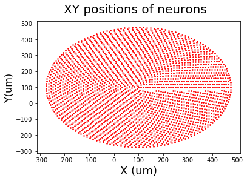
> Organoid diameter : 750um | Neuron diameter : 15um

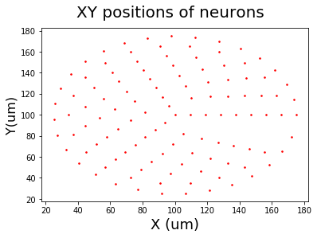
> Organoid diameter : 750um | Neuron diameter : 15um

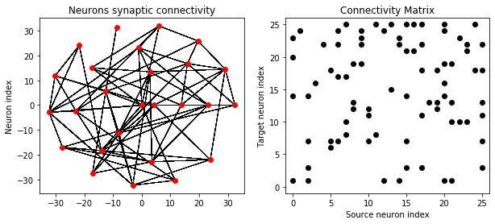
> Example of synaptic connection

## Synaptic connection according to distance

An example of synaptic connectivity rule to promote closer neighbors connection is equated as below :

p = pcon - pcon x dij / diamorg

* pcon the maximal connectivity probability
* dij the distance between source and target neuron
* diamorg the diameter of the organoid

When the distance **dij** reaches its maximum value which the organoid diameter **diamorg**, the division tends to 1 which means that the probability **p** is at lowest value.

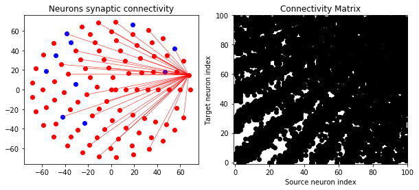
> Synaptic connection of one neuron according to distance (linear)
>
> Excitatory (red) | Inhibitory (blue)

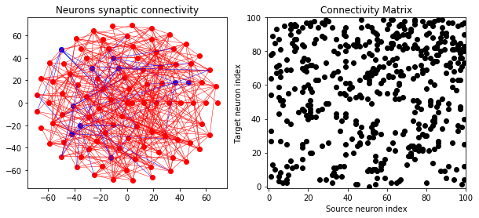
> Synaptic connection of 100 neurons according to distance (linear)
>
> Excitatory (red) | Inhibitory (blue)

## Tuning network activity

**Sweep synpatic current weight and connection probability**

The activity of the network can be modified by tuning probability synaptic connectivity as well as the weight of the synaptic current to reproduce behaviors such as network burst.

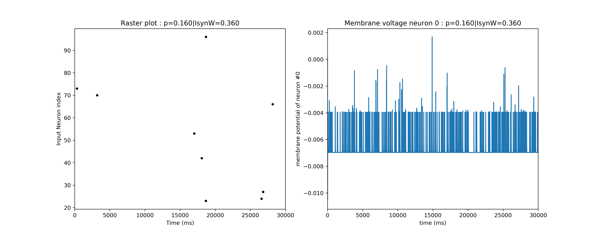
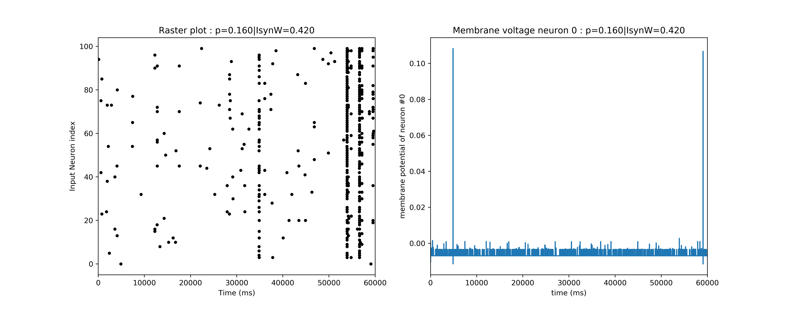
> Same probability of connection but different synaptic current weight

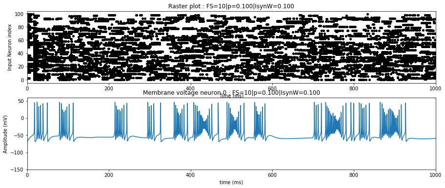
> Network activity with HH model
>
> FS as inhibitory neuron
> RS as excitatory neuron

**Model different organoid organisations**

Reproduce different organoid connection structures by adding different synaptic connection rules.

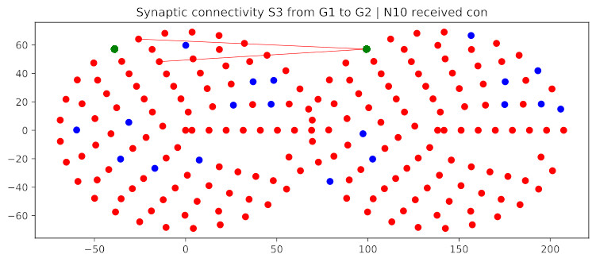
> Synaptic connection promoting proximity of neurons for assembloid (fused) structure

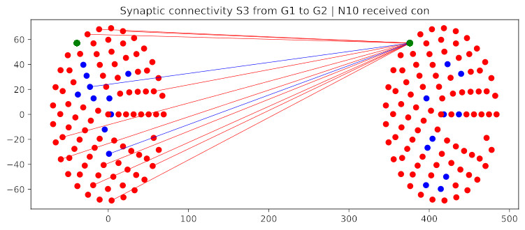
> Synaptic connection promoting location of neurons in the orgnaoid for connectoid structure

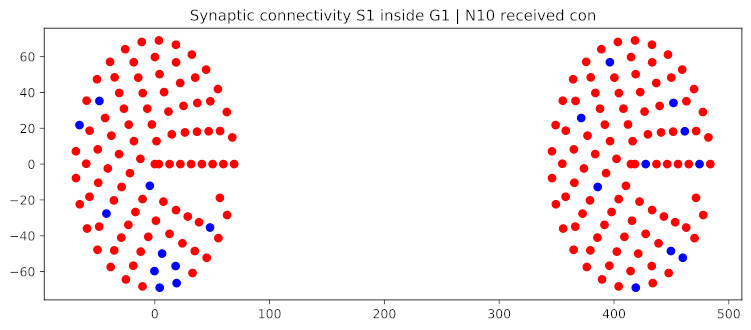
> Synaptic connection promoting mimicking the absence of synaptic connection between two independent organoids
